# Rian — App Map

> A living map of every view, modal, and dialog in `app.html`. Built incrementally so it stays accurate as the app grows. Screenshots live in `_docs/screenshots/`.

## How this doc is organised

Each top-level view (Timesheet, Notes, Routines, Callouts, Conflicts, AI) gets its own section with three layers:

1. **Inventory table** — every modal/dialog reachable from that view, with its DOM id, trigger function, close function, and what state it touches.
2. **Mermaid diagram** — navigation flow between the view, its sub-screens, and its dialogs.
3. **Per-modal notes** — purpose, when it appears, and any non-obvious behaviour.

Screenshots are added in a later pass and linked inline.

---

## 1. Timesheet (Week view) — `state.view === 'week'`

The default landing view. Shows the current Fri–Thu week with per-day activity cards, a header with hours metrics, and a hamburger menu.

### 1.1 Inventory

| Element | DOM id | Triggered by | Closes via | State touched |
|---|---|---|---|---|
| Header back/forward week | — | `prevWeek()` / `nextWeek()` | — | `state.weekStart`, `state.weekData` |
| Header hours/tasks tiles (expand) | — | `toggleHeaderExpanded()` | tap again | `state.headerExpanded` |
| Hamburger / theme menu | `theme-dropdown` | `toggleThemeMenu(event)` | `closeThemeMenu()`, backdrop click, Esc | `state.isMenuOpen` |
| Code Search | `code-modal` | code field tap | dismiss button | activity `.code` |
| Location Search | `location-modal` | location field tap | dismiss button | activity `.location` |
| Activity Notes editor | `notes-modal` | activity Notes field tap | dismiss | activity `.notes` |
| Activity context menu (Copy / Move / Add to Notes / Log Remedy) | `act-ctx-{id}` (per row) | `toggleActMenu(actId)` | `closeAllCtx()` (outside click) | `state._openCtxActId`, activity `.remedyPending` |
| Confirm dialog (delete task etc.) | `confirm-modal` | `showConfirm(title, body, onYes)` | Yes / No | depends on caller |
| Copy / Move picker | `copy-picker-modal` | `openCopyPicker(actId, di, moveMode)` | `closeCopyPicker()` | `copyPickerState`, target days |
| Add-to-Notes picker | `note-confirm-modal` | `openAddToNotes(actId, di)` | dismiss | notes target |
| Paste Ticket → Callout | `paste-ticket-modal` | (called from header / menu / voice) | dismiss | `state.callouts` |
| Jump to Week (date picker) | `date-modal` | menu → "Jump to Week" or `openDateModal()` | dismiss | `state.weekStart` |
| Email / Export Week preview | `email-preview-modal` | menu → "Email / Export Week" or `showEmailPreview()` | `closeEmailPreview()` | (read-only of `state.weekData`) |
| Snapshots / Recover (per-week history) | `snapshot-modal` | menu → "Snapshots / Recover" or `openSnapshotModal()` | dismiss | restores `state.weekData` |
| Cloud Backups (daily snapshots) | `backup-modal` | menu → "Cloud Backups" or `openBackupsModal()` | dismiss | restores everything |
| Restore confirm (final guard) | `restore-confirm-modal` | from inside backup/snapshot modals | Yes / No | triggers restore |
| Export All Data | `export-modal` | menu → "Export All Data" or `exportAllData()` | dismiss | (read-only download) |
| Import Data | `import-modal` | menu → "Import Data" or `importAllData()` | dismiss | overwrites everything |
| Notes Tag Manager | `tag-editor-modal` | menu → "Notes Tag Manager" or `openTagEditor()` | dismiss | `state.tags` (Notes only) |
| Voice listening | `voice-listen-modal` | mic FAB | mic stop / cancel | transient |
| Voice confirmation (parsed activity) | `voice-confirm-modal` | after voice parse | accept / cancel | adds activity to current day |
| AI Fault Assistant | `ai-fault-modal` | menu → "AI Assistant" or `openFaultAssistant()` | dismiss | none |

> The activity row's per-row context menu is the *only* place "Copy to…", "Move to…", "Add to Notes" and "Log Remedy" are reachable. Easy to miss when refactoring `renderCardView()`.

### 1.2 Navigation flow

```mermaid
flowchart TD
    Week[Timesheet / Week view]

    Week -->|prev/next chevrons| Week
    Week -->|tap code field| CodeModal[Code Search modal]
    Week -->|tap location field| LocModal[Location Search modal]
    Week -->|tap notes field| NotesModal[Activity Notes editor]
    Week -->|··· per row| ActCtx{{Activity context menu}}

    ActCtx --> CopyPicker[Copy / Move picker modal]
    ActCtx --> AddToNotes[Add to Notes picker]
    ActCtx --> RemedyToggle[/toggle remedyPending flag/]

    Week -->|delete button| Confirm[Confirm dialog]

    Week -->|hamburger ☰| SideMenu[Side menu / theme dropdown]

    SideMenu -->|Jump to Week| DateModal[Date picker]
    SideMenu -->|Email / Export Week| EmailPreview[Email preview modal]
    SideMenu -->|Snapshots / Recover| SnapshotModal[Snapshots modal]
    SideMenu -->|Cloud Backups| BackupModal[Cloud Backups modal]
    SideMenu -->|Notes Tag Manager| TagEditor[Tag editor]
    SideMenu -->|AI Assistant| AIFault[AI Fault Assistant]
    SideMenu -->|Export All Data| ExportModal[Export modal]
    SideMenu -->|Import Data| ImportModal[Import modal]

    SideMenu -->|Notebooks| NotesView[→ Notes view]
    SideMenu -->|Routines| RoutinesView[→ Routines view]
    SideMenu -->|Callouts| CalloutsView[→ Callouts view]
    SideMenu -->|Sync Conflicts badge| ConflictsView[→ Conflicts view]

    SnapshotModal --> RestoreConfirm[Restore confirm dialog]
    BackupModal --> RestoreConfirm

    Week -->|mic FAB| VoiceListen[Voice listening]
    VoiceListen --> VoiceConfirm[Voice confirmation]
    VoiceConfirm -->|accept| Week
```

### 1.3 Per-modal notes

Filled in incrementally — each entry says what the modal is for, when it shows up, and anything non-obvious about its behaviour.

**`code-modal` — Code Search.** Full-screen picker for the work code on an activity row. Search filters across `state.codeList`. Selecting a code writes back to `activity.code` and triggers `scheduleAutoSave()`.

**`location-modal` — Location Search.** Full-screen picker for the location field. Sources from the user's recent locations + the Exchange Finder dataset. Selection writes to `activity.location`.

**`notes-modal` — Activity Notes editor.** Lightweight textarea for the per-activity `notes` string. **Not** the same as the Notes view (which is TipTap-based, separate data store).

**Activity context menu — `act-ctx-{id}`.** Inline menu (not a modal) under the `···` button on each activity row. Holds the four "secondary" actions: Copy to…, Move to…, Add to Notes, Log Remedy. Closed automatically by document-level click handler.

**`copy-picker-modal` — Copy / Move picker.** Pick target days (within the current or any other week) to duplicate or move an activity. Has a built-in week navigator. `moveMode=true` removes from source after success. State lives in `copyPickerState`.

**`confirm-modal` — Generic confirm.** Used by `showConfirm(title, body, onYes)` for delete-task, clear-week, restore-snapshot, and any other yes/no guard. There are *two* DOM nodes with `id="confirm-modal"` (lines ~11306 and ~11481) — historical artefact, worth deduping when touched.

**`date-modal` — Jump to Week.** Native `<input type="date">` wrapped in a small modal. On change, snaps to the Fri-of-week and calls `loadWeek()`.

**`email-preview-modal` — Email / Export Week.** Static HTML in the body (not built dynamically). `showEmailPreview()` populates it from `buildPreviewHtml(state.weekData)`. Used to copy to clipboard or kick off a `mailto:` link.

**`snapshot-modal` — Snapshots / Recover.** Per-week version history from Firestore subcollection `users/{uid}/weeks/{weekStart}/snapshots/`. Each entry shows total hours + timestamp. Selecting → Restore confirm → overwrites `state.weekData` and pushes to Firestore.

**`backup-modal` — Cloud Backups.** Daily-rolling snapshots of the *whole* dataset (weeks + notes + callouts + reminders). Heavier than per-week snapshots. Used for "I lost everything" recovery.

**`restore-confirm-modal` — Restore confirm.** Final guard before any restore overwrites local data. Always reachable from snapshot/backup modals.

**`export-modal` / `import-modal` — JSON dump / load.** Full-data export and import. Import is destructive — it overwrites the current account's data.

**`tag-editor-modal` — Notes Tag Manager.** Despite living in the Timesheet menu, this only affects the **Notes** view (TipTap notes have tags; activities don't). Reachable everywhere because the menu is global.

**`paste-ticket-modal` — Paste Ticket → Callout.** Paste raw ticket text from another system; the parser extracts fields and creates a callout entry for the current week. Touches `state.callouts`, not `state.weekData`.

**`voice-listen-modal` / `voice-confirm-modal` — Voice entry.** Mic FAB → speech recognition → Gemini parses the transcript into an activity → confirm modal shows parsed fields → accept appends to current day.

**`ai-fault-modal` — AI Fault Assistant.** Gemini-powered chat scoped to the user's hours/sites/faults. Read-only — does not write back to `state.weekData`.

---

## 2. Notes view — `state.view === 'journal'`

*(to be filled — TipTap rich-text notebooks → sections → pages)*

## 3. Routines view — `state.view === 'routines'`

*(to be filled — monthly site visit tracker)*

## 4. Callouts view — `state.view === 'callouts'`

*(to be filled — on-call incident log)*

## 5. Conflicts view — `state.view === 'conflicts'`

*(to be filled — sync conflict resolution UI, currently the active dev focus)*

## 6. AI view — `state.view === 'ai'`

*(to be filled — full-screen Fault Assistant chat)*
